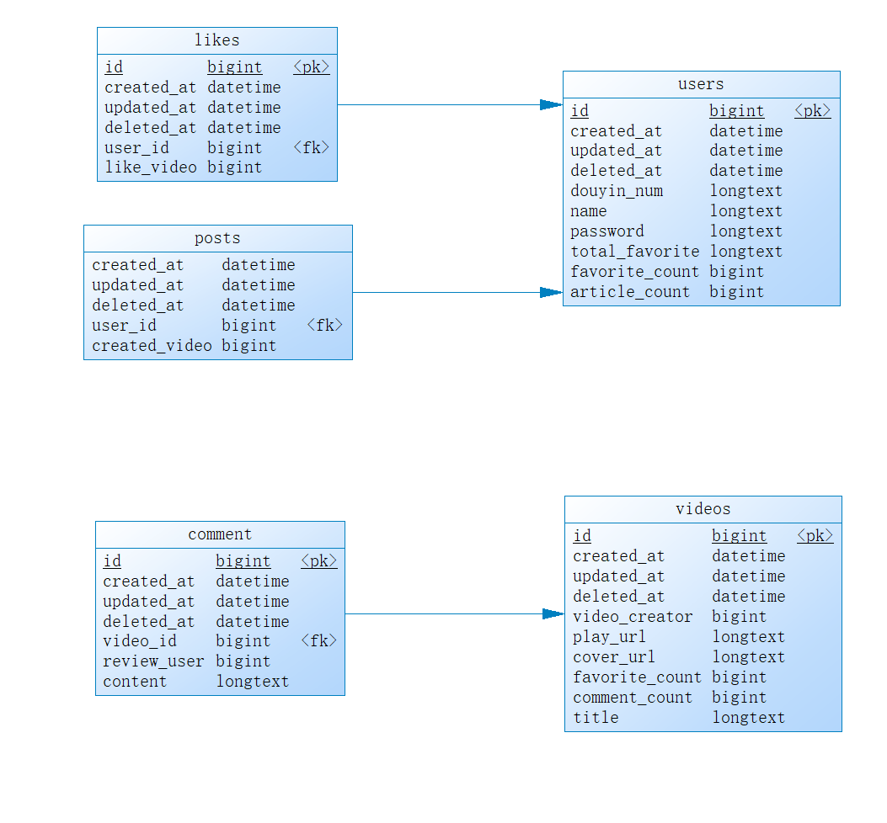

# 抖音项目服务端
## 项目github地址

https://github.com/cfddd/simple-demo-main

## 部署项目
项目使用goland开发，最后部署在1024code平台上


1024平台关闭后会自动结束运行，所以每次都要重新运行

重新运行操作见下文
### 0.线上地址
https://bytedance.feishu.cn/docx/NMneddpKCoXZJLxHePUcTzGgnmf
下载这个软件，安装后打开
长按“我”，进入高级设置
https://f60a0e162815344f1ea7f613bd1a3f38-app.1024paas.com/
把这个复制进去，然后点击重新启动
就可以刷抖声啦

### 1.新工作台
右上角选择“新建”，然后选择go语言

不要直接赋值demo代码里面的那个，没有mysql和相关的go支持

**因为在1024平台上直接clone代码构建项目不方便，于是选择将所有代码在本地编译好再上传上去**
### 2.go框架需求
需要gin,gorm和mysql驱动
```shell  
go get -u github.com/gin-gonic/gin
go get -u github.com/jinzhu/gorm
go get -u github.com/go-sql-driver/mysql
```  
然后再使用`go mod tidy`更新依赖
### 3.mysql配置

首先在命令行里链接数据库
```shell
mysql -h ${MYSQL_HOST} -P ${MYSQL_PORT} -u ${MYSQL_USER} -p
```
然后创建一个名为douyin的数据库
```shell
create database douyin;
```
在`database/iniMYSQL.go`文件中有如下内容
```go  
username := "root" //用户名  
password := "123456" //密码  
host := "127.0.0.1" //数据库地址，可以是IP或者域名  
port := 3306 //端口号  
Dbname := "douyin" //数据库名  
timeout := "10s" //超时连接，10秒  
```  
根据自己的mysql配置信息链接

创建一个名为douyin的数据库

然后运行该文件
>`DB.Debug().AutoMigrate(&models.Video{}, &models.Comment{}, models.User{}, &models.Like{}, &models.Post{})`
>这行代码是根据数据模型创建数据库中的表，仅第一次运行时需要使用
>每次关闭1024代码空间都会更换数据库的ip和端口，所以建议使用环境变量的方式给变量写

```go
	username := os.Getenv("MYSQL_USER") //用户名
	password := os.Getenv("MYSQL_PASSWORD")  //密码
	host := os.Getenv("MYSQL_HOST") //数据库地址，可以是IP或者域名
	port, _ := strconv.ParseInt(os.Getenv("MYSQL_PORT"), 10, 32) //端口号
	Dbname := "douyin" //数据库名
	timeout := "10s"     //超时连接，10秒

```
### 4.添加环境变量
使用到的ffmpeg软件通过添加一个环境变量由程序调用

ffmpeg 软件所在据对位置目录

> **注意**:1024code里面使用的linux环境，ffmpeg.exe无法使用，需要替换掉service/ffmpeg.exe文件为对应系统的版本
> [下载地址](https://johnvansickle.com/ffmpeg/)

D:\goland\simple-demo-main\service\ffmpeg.exe
下载后在1024平台解压
```shell
xz -d ffmpeg-git-amd64-static.tar.xz
tar -xvf ffmpeg-git-amd64-static.tar
#进入解压的文件夹下
./ffmpeg
#如果出现ffmpeg version N-66595-gc2b38619c0-static ...说明成功
```
然后添加环境变量
```shell
vim ~/.bashrc
# 在最后一行加上
export PATH="$PATH:/home/runner/app/simple-demo-main/for1024/ffmpeg-git-20230721-amd64-static"
# 手动更新
source ~/.bashrc
```
### 5.上传在本地编译好的文件
**因为在1024平台上直接clone代码构建项目不方便，于是选择将所有代码在本地编译好再上传上去**

我试了在1024上，遇到了各种问题（操作系统不同，goland本地写的包无法在1024用……）

在goland运行选择编辑运行选项`Run Condifuration`，在环境处加上
```
GOOS=linux;GOARCH=amd64
```
再取消选择`Run after build`

在选择一个输出路径即可

我一共上传了三个文件
- 下载好的ffmpeg压缩包
- 初始化数据库的代码编译的可执行文件
- 项目的可执行文件

> 1024每一次刷新链接，都会更新数据库的ip和端口
>
> 数据库和表都在，数据也不会没
>
> 所以我专门写了一个初始化数据库的代码，方便使用

### 6.全部完成，开始运行
在上面的所有内容都检查过后没有问题
就可以开始运行代码了

可执行文件刚被放上去，只是一个普通的文件，没有执行权限，需要用下面的权限让它可以运行
```
chmod +x ./xxx
./xxx
```
运行之后，1024code会给一个链接（感觉直接绑定在了这个8080默认端口上），放在postman里面可以直接访问

### 7.总结
1024code感觉用起来很吃力，很多地方没讲明白

linux基础有一点，但是不多

### 测试

test 目录下为不同场景的功能测试case，可用于验证功能实现正确性

其中 common.go 中的 _serverAddr_ 为服务部署的地址，默认为本机地址，可以根据实际情况修改

Aliyun OSS SDK for Go.go用于测试阿里云OSS
## 项目方向选择
https://bytedance.feishu.cn/docx/BhEgdmoI3ozdBJxly71cd30vnRc

**互动方向**
### 基础功能项
视频 Feed 流、视频投稿、个人主页

视频Feed流：支持所有用户刷抖音，视频按投稿时间倒序推出

视频投稿：支持登录用户自己拍视频投稿

个人主页：支持查看用户基本信息和投稿列表，注册用户流程简化
### 喜欢列表
登录用户可以对视频点赞，在个人主页喜欢Tab下能够查看点赞视频列表
### 用户评论
支持未登录用户查看视频下的评论列表，登录用户能够发表评论

## 项目分工
| 成员名称 | 接口成员分工                                                |
|------|-------------------------------------------------------|
| 高灵芝  | /favoriate/action/、/favoriate/list/、/publish/list 等接口 |
| 刘浩   | /user/、/user/Register/、/user/login/ 、/feed/ 等接口       |
| 常凤迪  | /publish/action/、 /comment/action/、/comment/list/ 等接口 |


| 成员名称 | 其他分工           |
|------|----------------|
| 高灵芝  | 文档撰写、测试代码      |
| 刘浩   | 文档撰写、测试代码      |
| 常凤迪  | 文档撰写、部署代码在1024 |

## 项目架构
按照controller，Handlers，Service自上而下

对应着数据接收，数据处理，数据存储

这三层按照这样的顺序调用：
>controller层调用Handlers层
>
>Handlers层调用Service层

其他的都在这个顺序的基础上调用，避免了出现循环导包的现象
### 详细说明
| 层级名称            | 功能         |
|-----------------|------------|
| middleware(中间件) | jwt登录信息验证  |
| common(前端数据格式)  | 返回给前端的数据格式 |
| controller(接口层) | 负责和前端消息的交互 |
| Handlers(逻辑处理层) | 处理相关的业务逻辑  |
| service(数据库调用层) | 数据库的增删改查函数 |
| Models(数据库模型层)  | 数据库的存储模型   |
下面是项目各层级的详细介绍

#### Middleware (中间件):
负责处理请求和响应之间的中间业务逻辑。

在请求到达控制器之前，中间件可以执行一些预处理逻辑，例如身份验证、权限检查、日志记录等。
#### Common (前端数据格式):
定义和管理前端数据的格式和结构。

包含定义前端请求和响应的数据格式、错误处理、返回给前端的数据格式等。
#### Controller (接口层):
处理和前端消息的交互，负责接收和响应前端的请求。

解析前端请求，调用适当的处理程序或服务来执行业务逻辑，并将结果返回给前端。
#### Handlers (逻辑处理层):
处理相关的业务逻辑。

包含具体的业务逻辑实现，根据业务需求处理请求，并与服务层进行交互。
#### Service (数据库调用层):
执行数据库的增删改查操作。

提供与数据库进行交互的函数和方法，包括读取和写入数据、查询数据、更新数据等。
#### Models (数据库模型层):
定义数据库的存储模型。

包含与数据库表或文档对应的模型定义，定义数据的结构和关系，以及与数据库的交互方法。

## 表结构
### 全局模型
```go
type PRE_MODEL struct {
	ID        uint           `gorm:"primarykey"` // 主键ID
	CreatedAt time.Time      // 创建时间
	UpdatedAt time.Time      // 更新时间
	DeletedAt gorm.DeletedAt `gorm:"index" json:"-"` // 删除时间
}
```

### 表模型

**video** 用来存储和视屏相关的数据
```go
type Video struct {
	global.PRE_MODEL
	VideoCreator  int       `json:"video_creator"` //User视频作者id
	PlayUrl       string    `json:"playUrl"`       //视频播放地址
	CoverUrl      string    `json:"coverUrl"`      //视频封面地址
	FavoriteCount int       `json:"favoriteCount"` //视频的点赞总数
	CommentCount  int       `json:"commentCount"`  //视频的评论总数
	Title         string    `json:"title"`         //视频标题
	Comments      []Comment `json:"comments"`      //用户评论列表
}
```
**comment** 用来存储和评论相关的数据
```go
type Comment struct {
	global.PRE_MODEL
	VideoID    uint   `json:"videoID"`     //外键视频id
	ReviewUser int    `json:"review_user"` //评论用户id
	Content    string `json:"content"`     //评论内容
}
```
**user** 用来存储用户信息相关的数据
```go
type User struct {
	global.PRE_MODEL
	DouyinNum     string `json:"douyin_num"` //抖音号
	Name          string `json:"name"`
	Password      string `json:"password"`
	TotalFavorited int    `json:"totalFavorite"` //获赞总数
	FavoriteCount int    `json:"favoriteCount"` //点赞总数
	WorkCount  int    `json:"articleCount"`  //视频总数
	Likes         []Like `json:"likes"`         //喜欢列表
	Posts         []Post `json:"posts"`         //作评列表
}
```

**post** 用来存储和用户作品相关的数据
```go
type Post struct {
	global.PRE_MODEL
	UserID       uint `json:"userID"`        //外键用户的id
	CreatedVideo int  `json:"created_video"` //视频id
}
```

**like** 用来存储用户的喜欢
```go
type Like struct {
	global.PRE_MODEL
	UserID    uint `json:"userID"`     //外键用户的id
	LikeVideo int  `json:"like_video"` //视频id
}
```

我们使用的是 mysql 数据库， 并使用 GORM 来进行表的创建：
```go
DB.AutoMigrate(&models.Video{}, &models.Comment{}, models.User{}, &models.Like{}, &models.Post{})
```

### 表数据
```
videos
-global.PRE_MODEL（ID、CreatedAt、UpdatedAt、DeletedAt）
-video_creator              integer                User视频作者id
-play_url                   string                 视频播放地址
-cover_url                  string                 视频封面地址
-favorite_count             integer                视频的点赞总数
-comment_count              integer                视频的评论总数
-title                      string                 视频标题
 
comments
-global.PRE_MODEL（ID、CreatedAt、UpdatedAt、DeletedAt）
-video_id                   integer                视频id
-review_user                integer                用户id
-content                    string                 评论内容

users
-global.PRE_MODEL（ID、CreatedAt、UpdatedAt、DeletedAt）
-name                       string                 用户名称
-douyin_num                 string                 抖音号
-password                   string                 用户密码
-total_favorited            integer                获赞总数
-favorite_count             integer                点赞总数
-article_count              integer                视频总数

posts
-global.PRE_MODEL（ID、CreatedAt、UpdatedAt、DeletedAt）
-uesr_id                    integer                用户id
-like_video                 integer                视频id

likes
-global.PRE_MODEL（ID、CreatedAt、UpdatedAt、DeletedAt）
-user_id                    integer                用户的id
-created_video              interger               视频id
```

### 数据库关系图


## 代码解释

#### jwt鉴权

首先创建一个带用户信息的实体：
```go
type MyCustomClaims struct {
	UserID   uint
	UserName string
	jwt.StandardClaims
}
```

创建 token ：
```go
claim := MyCustomClaims{
	UserID:   userid,
	UserName: username,
	StandardClaims: jwt.StandardClaims{
		Issuer:    "hdheid",                              //签发者
		Subject:   "usertoken",                           //签发对象
		IssuedAt:  time.Now().Unix(),                     //签发时间：当前
		ExpiresAt: time.Now().Add(48 * time.Hour).Unix(), //过期时间：48小时后
	},
}
token, err := jwt.NewWithClaims(jwt.SigningMethodHS256, claim).SignedString([]byte(Key))
return token, err
```
给实体赋值，然后使用 jwt-go 包的 NewWithClaims 和 SignedString 函数进行 token 的生成。
`[]byte(Key)` 是将字符串类型的密钥转化为切片类型。

验证 token
用来判断 token 是否有效。

获取token：
```go
//将 tokenString 转化成 MyCustomClaims 的实例
token, err := jwt.ParseWithClaims(tokenString, &MyCustomClaims{}, func(token *jwt.Token) (interface{}, error) {
    return []byte(Key), nil //返回签名密钥
})
```

判断 token 是否有效：
```go
//判断token是否有效
if !token.Valid {
	return nil, errors.New("claim invalid")
}

claims, ok := token.Claims.(*MyCustomClaims)
if !ok {
	return nil, errors.New("invalid claim type")
}
```

设置全局中间件，用来判断用户的登陆状态：
```go
//获取token
tokenString := c.Query("token")
if tokenString == "" {
	tokenString = c.PostForm("token")
}
```

各种无效的 token ：
```go
//用户不存在
if tokenString == "" {
	c.JSON(http.StatusOK, common.Response{
            StatusCode: 401,
            StatusMsg:  "用户不存在",
		})
	    c.Abort() //拦截
        return
    }

    //token验证
    token, err := VerifyTokenHs256(tokenString)
    if err != nil {
        c.JSON(http.StatusOK, common.Response{
            StatusCode: 403,
            StatusMsg:  "验证失败",
        })
        c.Abort() //拦截
        return
    }

    //token超时
    if token.ExpiresAt < time.Now().Unix() {
        c.JSON(http.StatusOK, common.Response{
            StatusCode: 402,
            StatusMsg:  "令牌过期",
        })
        c.Abort() //拦截
        return
    }
```

成功判断 token 后，设置用户的上下文信息：
```go
    //设置上下文的用户信息
    c.Set("username", token.UserName)
    c.Set("user_id", token.UserID)
```

#### user---用户

##### 用户注册：/user/register/

判断用户是否存在->将密码哈希处理后存在数据库->创建 token ->将数据返回
```go
//判断用户是否存在
if _, exist := Handlers.UserExist(username); exist {
    c.JSON(http.StatusOK, common.UserRegisterResponse{
        Response: common.Response{
            StatusCode: 1,
            StatusMsg:  "用户已经存在",
        },
    })
    return
}

//将密码哈希处理后存在数据库
passwordHashed, err := PasswordHash(password)

//创建token
token, err := middleware.CreateTokenUsingHs256(user.ID, user.Name)

//将数据返回
userResponse := common.UserResponse{
    UserId: user.ID,
    Token:  token,
}
//返回token
return userResponse, nil
```

**将密码哈希处理**:

我们使用哈希函数对密码进行哈希处理，然后将哈希值存储在数据库中。当用户登录时，将其提供的密码与数据库中的哈希值进行比对，以验证密码的正确性。这样可以保证密码的安全性以保证密码不会被泄露。

我们使用了 bcrypt 算法对密码进行哈希和加盐处理，这是一种常见且安全的方式。
```go
//对密码进行哈希处理
PasswordHashed, err := bcrypt.GenerateFromPassword([]byte(password), bcrypt.DefaultCost)
```

##### 用户登录：/user/login/

查询用户是否存在->检验密码是否正确->创建 token ->将数据返回
```go
//查询用户是否存在
user, err := service.UseFind(username)

//检验密码是否正确
err = bcrypt.CompareHashAndPassword([]byte(user.Password), []byte(password))

//创建token
token, err := middleware.CreateTokenUsingHs256(user.ID, user.Name)

//返回响应数据
userResponse := common.UserResponse{
    UserId: user.ID,
    Token:  token,
}
return userResponse, nil
```
`CompareHashAndPassword` 是一个用于比较密码哈希值和明文密码是否匹配的函数。

##### 用户信息处理：/user/login/
获取用户 id ->通过用户 id 查找用户信息->将数据返回
```go
//获取用户信息
UserID := c.Query("user_id")
newuser, err := Handlers.GetUserInfo(UserID)

//通过 userid 获取用户信息
user, err := service.GetUser(id)
if err != nil {
    return common.User{}, err
}
newuser := UserInformationFormatConversion(user)

return newuser, nil
```

##### 视频流接口：/feed/
通过前端传来的时间戳获取固定长度的视频列表->如果视频列表循环完毕将重新循环->获取最早视频时间戳用来返回给前端->进行格式转换->将数据返回
```go
//验证用户登陆信息
tokenStruct, err := middleware.VerifyTokenHs256(token)

//视频列表开始时间（以视频创作时间来比较）
startTime, err := strconv.ParseInt(lastTime, 10, 64)
if err != nil {
    startTime = time.Now().Unix()
}

//如果视频列表循环完毕，将重新循环
videoList, err := service.FeedFrom(startTime)
if err != nil || len(videoList) == 0 {
    return nil, time.Now().Unix()
}

//将下一次返回的时间戳修改为最早的视频创建时间
videoListLen := len(videoList)
nextTime := videoList[videoListLen-1].CreatedAt.Unix()

//将获取到的视频数据修改为前端响应的格式
videoListToFeed := make([]common.Video, videoListLen)
for i, video := range videoList {
    videoListToFeed[i] = VideoInformationFormatConversion(video)
    //判断当前浏览用户是否点赞该视频
    if tokenStruct != nil {
        //如果存在该点赞记录，则 IsFavorite 为真
        if !service.LikeExit(tokenStruct.UserID, video.ID) {
            videoListToFeed[i].IsFavorite = true
        }
    }
}

//将数据返回
return videoListToFeed, nextTime
```

#### publish---发布

##### 发布视频：/publish/action/

1. 处理文件名
2. 保存视频信息在saveFile路径
3. 保存视频第1帧在视频相同路径，生成的图片自动加上.png后缀
4. 在数据库中保存视频信息，包括视频和封面的URL
5. 上传视频文件和视频封面图片到OSS
6. 删除保存在本地的视频和视频封面图片
7. 在对应数据库添加对应发布视频的信息

关于视频封面的生成：

1. 使用了ffmpeg把上传视频的第1帧作为视频封面
2. 然后把视频和图片先暂存在本地public下，再上传到阿里云OSS
3. 视频的名称就是user.Id+filename
4. 封面名称就是user.Id+filename+.png
5. 例如test.mp4,封面是test.mp4/png

```go
// 处理文件名
// 如果videoName的长度大于15，只拿后15个字符
// finalName是视频最终的名称
// saveVideoNameFile是保存的文件路径
videoName := filepath.Base(data.Filename)
videoNameLlength := len(videoName)
if videoNameLlength > 15 {
videoName = videoName[videoNameLlength-15:]
}
finalName := fmt.Sprintf("%d_%s_%s", userId, time.Now().Format("2006_01_02_15_04_05"), videoName) //文件格式不能有_以外的特殊字符
saveVideoNameFile := filepath.Join("./public", finalName)

//保存视频信息在saveFile路径
err = saveUploadedVideo(data, saveVideoNameFile)
if err != nil {
    return
}

//保存视频第1帧在视频相同路径，生成的图片自动加上.png后缀
err = saveGetSnapshot(saveVideoNameFile, saveVideoNameFile, 1)
if err != nil {
    return
}

//在数据库中保存视频信息
videoUrl := "https://cfddfc.oss-cn-beijing.aliyuncs.com/public/" + finalName
videoCoverUrl := "https://cfddfc.oss-cn-beijing.aliyuncs.com/public/" + finalName + ".png"

videoInfo := models.Video{
    Title:         title,
    PlayUrl:       videoUrl,
    CoverUrl:      videoCoverUrl,
    VideoCreator:  userId,
    CommentCount:  0,
    FavoriteCount: 0,
}

// 上传视频文件和视频封面图片到OSS
err = uploadFileToOSS(finalName)
if err != nil {
    return err
}

// 删除保存在本地的视频和视频封面图片
err = deleteFile(saveVideoNameFile)
if err != nil {
    return err
}
```
保存视频信息在saveFile路径:
```go
func saveUploadedVideo(file *multipart.FileHeader, dst string) error {
	src, err := file.Open()
	if err != nil {
		return err
	}
	defer src.Close()

	out, err := os.Create(dst)
	if err != nil {
		return err
	}
	defer out.Close()

	_, err = io.Copy(out, src)
	return err
}
```

保存视频第1帧在视频相同路径，生成的图片自动加上.png后缀:
```go
// SaveGetSnapshot 根据videoPath视频，生成第frameNum帧，并保存在finalName，生成的图片自动加上.png后缀
func saveGetSnapshot(videoPath, finalName string, frameNum int) (err error) {

	buf := bytes.NewBuffer(nil)

	err = ffmpeg.
		Input(videoPath).
		Filter("select", ffmpeg.Args{fmt.Sprintf("gte(n,%d)", frameNum)}).
		Output("pipe:", ffmpeg.KwArgs{"vframes": 1, "format": "image2", "vcodec": "mjpeg"}).
		WithOutput(buf, os.Stdout).
		Run()

	if err != nil {
		log.Fatal("生成缩略图失败：", err)
		return err
	}

	img, err := imaging.Decode(buf)
	if err != nil {
		log.Fatal("生成缩略图失败：", err)
		return err
	}

	err = imaging.Save(img, finalName+".png")
	if err != nil {
		log.Fatal("生成缩略图失败：", err)
		return err
	}
	return nil
}
```

上传视频文件和视频封面图片到OSS:
```go
// uploadFileToOSS 上传视频文件和视频封面图片到OSS
func uploadFileToOSS(finalName string) (err error) {
	//初始化OSS信息
	err = initOSS()
	if err != nil {
		return err
	}

	//上传视频文件到OSS
	{
		//本地文件
		src, err := os.Open("./public/" + finalName)
		if err != nil {
			return err
		}
		defer src.Close()

		//远端存储逻辑路径
		err = bucket.PutObject("public/"+finalName, src)
		if err != nil {
			return err
		}
	}
	//上传视频封面图片到OSS
	{
		//本地文件
		src, err := os.Open("./public/" + finalName + ".png")
		if err != nil {
			return err
		}
		defer src.Close()
		//远端存储逻辑路径
		err = bucket.PutObject("public/"+finalName+".png", src)
		if err != nil {
			return err
		}
	}
	return nil
}
```

删除保存在本地的视频和视频封面图片:
```go
// deleteFile 删除视频文件和视频封面图片
func deleteFile(saveFileName string) (err error) {
	//删除./public/finalName和./public/finalName.png
	err = os.Remove(saveFileName)
	if err != nil {
		log.Println("删除视频文件失败:", err)
	}
	err = os.Remove(saveFileName + ".png")
	if err != nil {
		log.Println("删除视频封面图片失败:", err)
	}
	return nil
}
```

##### 获取发布视频列表：/publish/list/

根据用户id查找posts数据库中该用户发布的视频信息

```go
// GetPostList 根据用户id，查找posts表中该用户发布是视频列表，存储成切片格式
func GetPostList(userId uint) ([]models.Post, error) {
	var postList []models.Post
	err := database.DB.Table("posts").Where("user_id = ?", userId).Find(&postList).Error
	return postList, err
}
```
然后根据视频信息中对应的视频id，查找videos数据库中对应的视频信息，并将视频信息转换成前端需要的格式
```go
// 转换成前端格式的video
front_postList := make([]common.Video, len(postList))
for i, post := range postList {
    video, _ := Handlers.GetVideoInformation(post.CreatedVideo)
    // 视频信息转换成前端需要的视频格式
    front_postList[i] = Handlers.VideoInformationFormatConversion(video)
}
```

#### like---喜欢列表

##### 点赞操作：/favorite/action/

开启事务：

```go
tx := database.DB.Begin()
```

点赞时先实例化当前喜欢信息，然后查找数据库的所有喜欢列表

```go
giveLike := models.Like{
    UserID:    userId,
    LikeVideo: videoId,
}
```

如果数据库没有这条喜欢的信息就是点赞：

- 那么对应的视频发布者的被点赞数和当前用户的点赞总数和视频被点赞数都会增加

如果有这条喜欢的信息就是取消点赞：

- 那么对应的视频发布者的被点赞数和当前用户的点赞总数和视频被点赞数都会减少

```go
// 事物操作，调用service层，根据点赞或是取消点赞进行相应函数的调用
if service.LikeExit(userId, videoId) { // 不存在，就是点赞
    if err := service.CreateLikeTx(tx, giveLike); err != nil {
        tx.Rollback() // 回滚事务
        return err
    }
    
    if err := service.OperateVideoFavorite_countTx(tx, videoId, 1); err != nil {
        tx.Rollback() // 回滚事务
        return err
    }
    
    if err := service.OperateUserFavoriteCountTx(tx, userId, 1); err != nil {
        tx.Rollback() // 回滚事务
        return err
    }
    
    creatorId, err := service.GetVideoAuthor(videoId)
    if err != nil {
        tx.Rollback() // 回滚事务
        return err
    }
    
    if err := service.OperateCreatorTotalFavoritedTx(tx, creatorId, 1); err != nil {
        tx.Rollback() // 回滚事务
        return err
    }
} else { // 取消点赞
    if err := service.DeleteLikeTx(tx, giveLike); err != nil {
        tx.Rollback() // 回滚事务
        return err
    }
    
	//........同上只是最后一个参数改为-1
}
tx.Commit() // 提交事务
return nil
```

##### 获取点赞视频列表：/favorite/list/

在数据库中的喜欢列表查找当前用户的所有喜欢视频，存储在切片数组中返回给前端

```go
// 从数据库查询喜欢列表
func GetLikeList(userId uint) ([]models.Video, error) {
	// 查询当前id用户的所有点赞信息
	likeList, _ := service.GetLikeList(userId)

	var videoList []models.Video
	// 根据点赞信息，查找对应的视频信息
	for _, like := range likeList {
		// 根据视频ID查找对应视频信息
		video, _ := service.FindVideo(like.LikeVideo)
		videoList = append(videoList, video)
	}
	return videoList, nil
}
```

##### 格式转换

将返回的视频数据替换成前端的版本
```go
// 转换成前端格式的video
front_videoList := make([]common.Video, len(videoList))
for i, video := range videoList {
    // 视频信息转换成前端需要的视频格式
    front_videoList[i] = Handlers.VideoInformationFormatConversion(video)
}
```

```go
// VideoInformationFormatConversion 将视频信息转换成前端格式的视频信息
func VideoInformationFormatConversion(hostvideo models.Video) common.Video {
	var newvideo common.Video
	// 根据视频的发布者id找到对应发布者的信息
	author, _ := service.GetUser(hostvideo.VideoCreator)

	newvideo.Id = int64(hostvideo.ID)
	newvideo.FavoriteCount = int64(hostvideo.FavoriteCount)
	// 并转换成前端需要的用户信息
	newvideo.Author = UserInformationFormatConversion(author)
	newvideo.PlayUrl = hostvideo.PlayUrl
	newvideo.CoverUrl = hostvideo.CoverUrl
	newvideo.CommentCount = int64(hostvideo.CommentCount)
	newvideo.IsFavorite = false
	newvideo.Title = hostvideo.Title
	return newvideo
}
```

#### comment--评论

##### 发布评论：/comment/action/

添加评论:
```go
err = service.AddCommentWithTransaction(tx, models.Comment{
    VideoID:    uint(comment.VideoId),
    ReviewUser: uint(userId),
    Content:    comment.CommentText,
})
```

修改评论:
```go
err = service.ChangeVideoCommentCountWithTransaction(tx, uint(comment.VideoId), 1)
if err != nil {
    tx.Rollback() // 发生错误时回滚事务
    return err
}
```
删除评论:
```go
err = service.DeleteCommentWithTransaction(tx, uint(commentID))
if err != nil {
    tx.Rollback() // 发生错误时回滚事务
    return err
}
```

##### 获取视频评论：/comment/list/

获取评论列表:
```go
func GetCommentList(videoId int64) (CommentList []common.Comment) {
	commentData, _ := service.GetCommentList(uint(videoId))

	for _, comment := range commentData {
		CommentList = append(CommentList, CommentInformationFormatConversion(comment))
	}
	return
}
```

## 番外

### 阿里云相关配置
在权限控制里面的读写权限需要修改
默认是私有，可以改为readOnly

只是测试了一次，就把对象存储免费的OSS流量（只有2GB）用完了
后续套餐续费还挺贵的，49元/100GB/月

暂时先不测试，因为前端没有缓存已有的视频数据，每次都要下载才行，就导致流量用量很大
继续用demo视频

将读写权限改回私有的，就可以随意测试除了播放视频的功能

发布视频上传的流量很多，完全够用

但是公网的下行流量很少，且很贵

前端应该缺少缓存视频的功能

### bug收集
1. 用户的信息只在用户登陆的时候获取？
    经过多次测试，确实是这样

### 1024code工作台
一定要选go，直接复制来的那个工作台里面没有mysql工具
很不方便